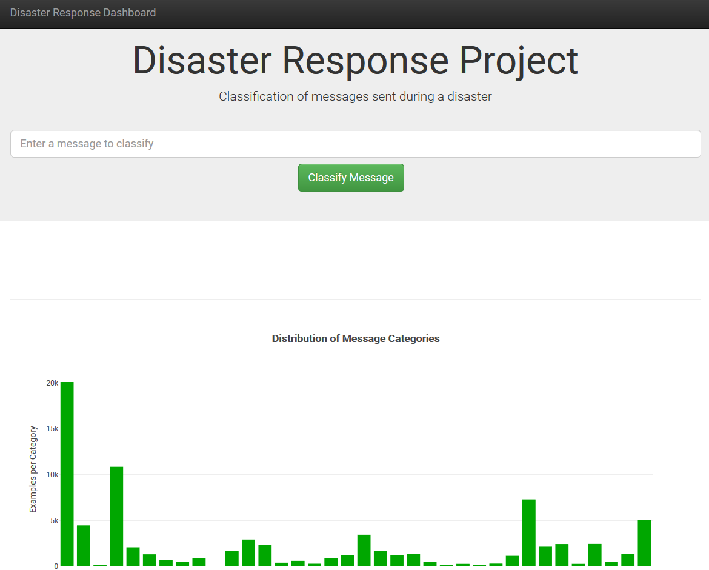
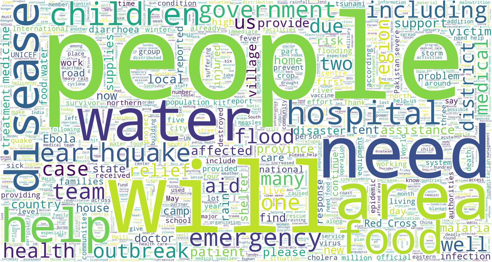

# Disaster Response Web App

## Table of Contents
1. [Description](#description)
2. [Getting Started](#getting_started)
3. [Authors](#authors)
4. [License](#license)

## Description

The project aim is to build a NLP model to categorize messages and create a web app through which new messages could be classified. The dataset contains pre-labelled tweets and messages from real disaster events.

This project is divided in the following key sections:

1. Processing data, building an ETL pipeline to extract data from two csv files, cleaning the data and saving it to a database
2. Build a machine learning pipeline to train model which can classify text message into set categories
3. Create web app which can be used for prediction of new messages

## Getting Started

### Dependencies
* Python 3.5+
* Data Preprocessing: NumPy, Pandas
* Machine Learning Libraries: Sciki-Learn, XGBoost
* Natural Language Process Libraries: NLTK
* Database Library: SQLalchemy
* Model Loading and Saving Library: Pickle
* Web App and Data Visualization: Flask, Plotly

### Executing Program:
You can run the following commands in the project's directory to set up the database, train model and save the model.

1. To run ETL pipeline to clean data and store the processed data in the database
        `python etl.py data/disaster_messages.csv data/disaster_categories.csv data/database.db`

2. To run the ML pipeline that loads data from database, trains the classifier and saves the classifier as a pickle file
        `python train_classifier.py data/database.db models/classifier.pkl`

3. Run the following command in the app's directory to run the web app. One does not need to run the previous two steps as their output is already saved.
        `python run.py`

4. Type `localhost:3001` in your browser

### Additional Material

In the **data** and **models** folder you can find jupyter notebooks that will help you understand how the code was developed
1. **ETL Pipeline Dev**: on development of ETL pipeline
2. **ML Pipeline Dev**: on development of Machine Learning Pipeline

### Important Files
**app/templates/***: templates/html files for web app

**data/etl.py**: ETL pipeline used for data cleaning, feature extraction, and storing data in a SQLite database

**models/train_classifier.py**: A machine learning pipeline that loads data, trains a model, and saves the trained model as a .pkl file for later use

**run.py**: This file can be used to launch the Flask web app used to classify disaster messages

## Authors

* [Dario Culig-Tokic](https://darioct.github.io/)

## License

